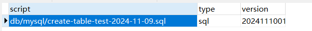

# mybatis-plus-ddl-example


在MyBatis-Plus的`3.5.3+`版本中，引入了一项强大的功能：数据库DDL（数据定义语言）表结构的自动维护。这一功能通过执行SQL脚本来实现数据库模式的初始化和升级，与传统的flyway工具相比，它不仅支持分表库，还能够控制代码执行SQL脚本的过程。

代码示例：

我们在项目的 `resource`目录下，创建目录：`db/mysql`，并新建一个或多个sql脚本：`create-table-test-2024-11-09.sql`。

脚本如下：

```sql
drop table if exists ddl_test;
create table if not exists ddl_test (
    id int not null auto_increment,
    name varchar(50),
    primary key (`id`)
);
```
实现`IDdl`接口：

```java
package org.example.config;

import cn.hutool.core.io.FileUtil;
import cn.hutool.core.io.file.PathUtil;
import cn.hutool.core.io.resource.Resource;
import cn.hutool.core.io.resource.ResourceUtil;
import cn.hutool.core.util.StrUtil;
import com.baomidou.mybatisplus.extension.ddl.IDdl;
import lombok.RequiredArgsConstructor;
import lombok.extern.slf4j.Slf4j;
import org.springframework.beans.factory.annotation.Autowired;
import org.springframework.beans.factory.annotation.Value;
import org.springframework.stereotype.Component;
import org.springframework.util.ResourceUtils;

import javax.sql.DataSource;
import java.io.File;
import java.nio.file.Path;
import java.nio.file.Paths;
import java.util.Arrays;
import java.util.List;
import java.util.function.Consumer;

/**
 * @author herongqin
 * @date 2024/11/9 23:51
 **/
@Component
@Slf4j
public class MysqlDdl implements IDdl {
    private final DataSource dataSource;

    @Autowired
    public MysqlDdl(final DataSource dataSource) {
        this.dataSource = dataSource;
    }
    @Value("${mybatis-plus.ddl.dir.mysql:db/mysql}")
    private String dir;

    @Override
    public void runScript(Consumer<DataSource> consumer) {
        consumer.accept(dataSource);
    }

    @Override
    public List<String> getSqlFiles() {
        File file = FileUtil.file(dir);
        if (file.isDirectory()) {
            return Arrays.stream(file.listFiles()).map(t -> StrUtil.join("/", dir, t.getName())).toList();

        }
        return null;
    }
}

```

以上代码执行后：

- 首次使用时，系统会在数据库中创建一个名为`ddl_history`的表，用于记录每次执行的SQL脚本版本信息。
- 会根据`getSqlFiles`方法返回的脚本集合执行脚本，该方法默认会去：`db/mysql`读取所有的sql文件。
- 可以在配置文件中配置：`mybatis-plus.ddl.dir.mysql` 覆盖默认的脚本目录。



